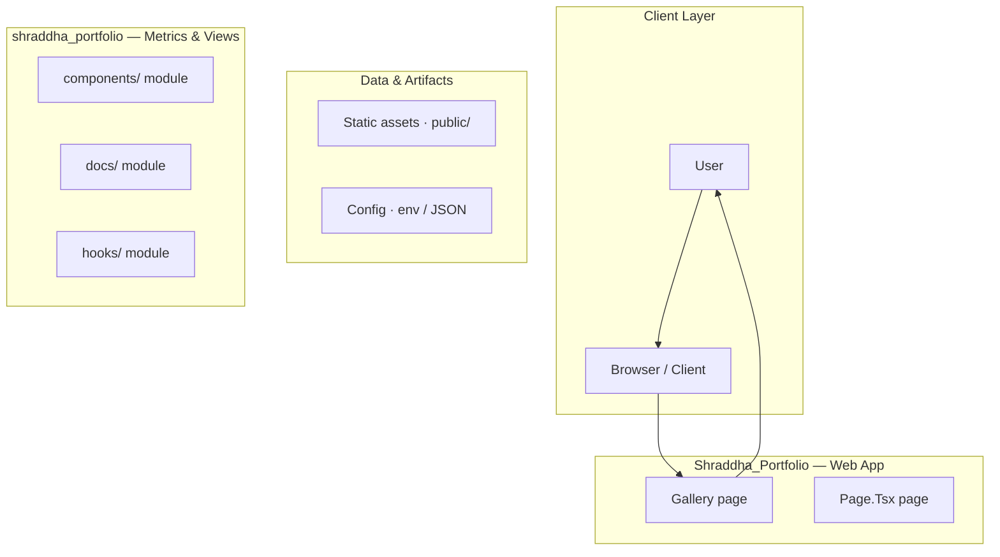
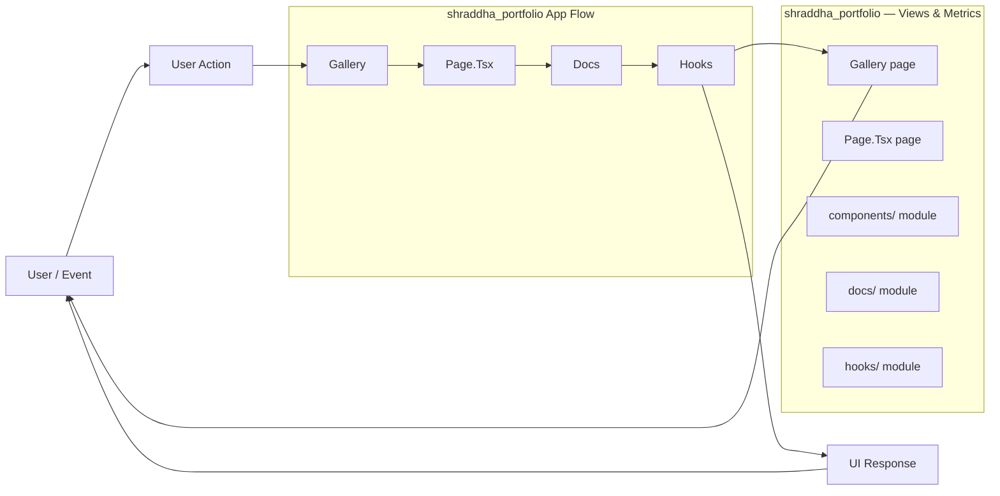
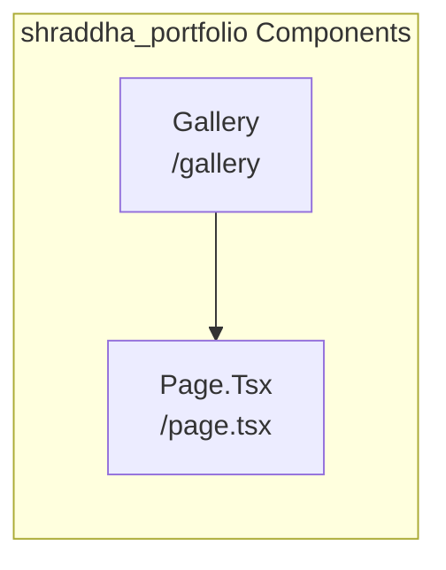
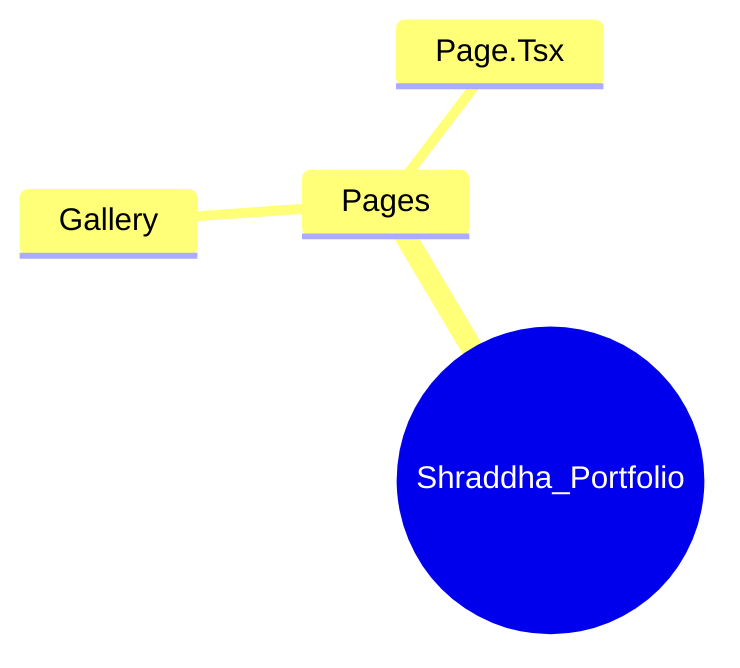

# High-Performance, Data-Driven Portfolio Website

A highly interactive, performance-optimized portfolio built with Next.js and advanced WebGL technologies (Three.js) to showcase complex front-end development skills.

## Overview

This project is a sophisticated, modern portfolio website designed to serve as a comprehensive showcase of advanced front-end development capabilities. It utilizes Next.js 14, TypeScript, and a rich suite of animation libraries (Framer Motion, GSAP) alongside WebGL rendering via Three.js and React Three Fiber (R3F). The architecture is designed not only for visual appeal but also incorporates a data-driven pipeline to track user interactions and funnel conversion, suggesting a focus on measurable user experience.

## Solution

The solution is a single-page application (SPA) experience that transforms the traditional static portfolio into a dynamic, immersive web experience. It solves the problem of merely listing projects by providing an interactive, scroll-based narrative that guides the user through the developer's skills, projects, and contact information using advanced animations and 3D elements.

## Key Features

- Immersive 3D Visualization: Features a dynamic 3D sphere and particle system on the landing page, built using Three.js and R3F.
- Advanced Scroll-Based Animation: Utilizes scroll-driven animations (GSAP, Framer Motion) to reveal content and guide the user through different sections.
- Data-Driven Analytics Pipeline: Implements a data flow mechanism to track user events, including page views and contact funnel progression, ensuring the portfolio is measurable.
- Interactive Gallery: Includes a dedicated gallery section to showcase various projects.
- Modern UI/UX: Built with Tailwind CSS for utility-first styling, ensuring a responsive and visually polished user interface.

## Technology Stack

- Next.js
- TypeScript
- Tailwind CSS
- Three.js
- @react-three/fiber
- @react-three/drei
- Framer Motion
- GSAP
- Lenis

# 🚀 Professional Portfolio Website

This repository contains a highly optimized, modern portfolio website built using Next.js 14 and TypeScript. It is designed to showcase a developer's skills with advanced animations, complex UI interactions, and a clean, responsive aesthetic.

This project demonstrates mastery of modern web development practices, including server components, client-side state management, and advanced animation libraries.

--- 

## ✨ Features

*   **Advanced Animation:** Utilizes Framer Motion and Three.js for smooth, engaging, and performance-optimized animations (e.g., scroll-triggered effects, 3D elements).
*   **Performance Focus:** Built with Next.js 14, leveraging Server Components for optimal rendering and fast load times.
*   **Responsive Design:** Fully adaptive layout using Tailwind CSS, ensuring a flawless experience on all devices.
*   **Interactive UI:** Includes complex components like custom scroll-based animations (Lenis) and interactive project showcases.

## 🛠️ Tech Stack

*   **Framework:** Next.js 14 (App Router)
*   **Language:** TypeScript
*   **Styling:** Tailwind CSS
*   **Animation:** Framer Motion, Three.js
*   **Scroll Management:** Lenis
*   **State Management:** React Context API

## 🚀 Getting Started

Follow these steps to set up and run the project locally.

### Prerequisites

Ensure you have Node.js (v18+) and npm installed on your system.

### Installation

1.  **Clone the repository:**
    ```bash
    git clone [repository-url]
    cd [repository-name]
    ```

2.  **Install dependencies:**
    ```bash
    npm install
    # or
    yarn install
    ```

3.  **Run the development server:**
    ```bash
    npm run dev
    # The site should now be accessible at http://localhost:3000
    ```

## 📂 Project Structure & Components

The project is organized using the Next.js App Router structure. Key components and directories include:

### Core Layout & Pages
*   `app/`: Root directory for Next.js routing.
*   `components/layout/`: Contains global layout elements (e.g., `Header`, `Footer`).
*   `components/sections/`: Houses major, reusable sections of the portfolio (e.g., `Hero`, `Projects`, `Skills`).

### Key Components
*   `Hero.tsx`: The main landing section, featuring initial animations and calls to action.
*   `Projects.tsx`: Displays the portfolio items, often utilizing a grid layout and interactive hover effects.
*   `Skills.tsx`: Visually represents technical proficiencies.
*   `ContactForm.tsx`: Handles user input and submission logic.

### Customization

*   **Theming:** Global styles and color palettes are managed via `tailwind.config.js`.
*   **Content:** All textual and image content should be updated within the respective `.tsx` files in `components/sections/`.
*   **Animations:** Animation logic is primarily contained within the component files, utilizing `framer-motion` hooks.

## ⚙️ Advanced Architecture (For Developers)

This section details the underlying system architecture and data flow, useful for contributors or advanced debugging.

### System Flow Diagram

### Component Interaction Diagram

## 🚀 Building and Deployment

### Build Command

To generate the optimized production build:
```bash
npm run build
```

### Running in Production

To start the production server:
```bash
npm run start
```

--- 

*Developed with Next.js 14, TypeScript, and a commitment to performance and clean code.*

## Setup Guide

### Frontend Setup

```bash

npm install
npm run dev     # development
npm run build && npm start   # production
```

Open `http://127.0.0.1:3000` (or the port shown in the terminal).

### Running the Application

1. **Start web app** — `npm run dev` in `./`

```bash
cd .
npm install
npm run dev
```

## System Architecture

High-level system design, data flows, API map, and workflow pipelines derived from the repository structure.

### System Architecture



### Data Flow & Charts Pipeline



### Component & API Map



### Application Page Map


