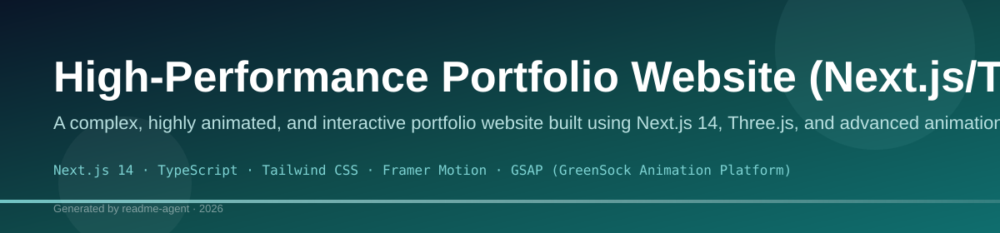
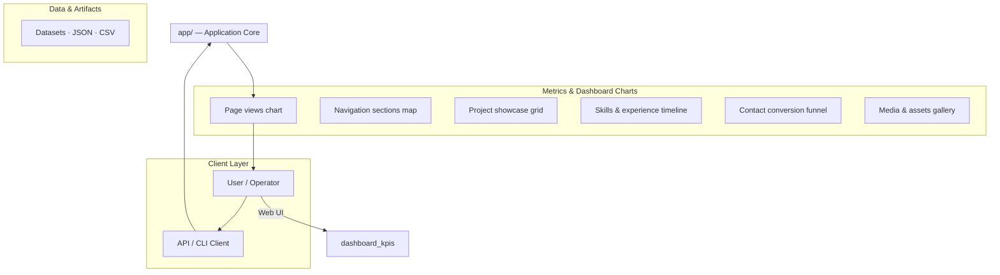
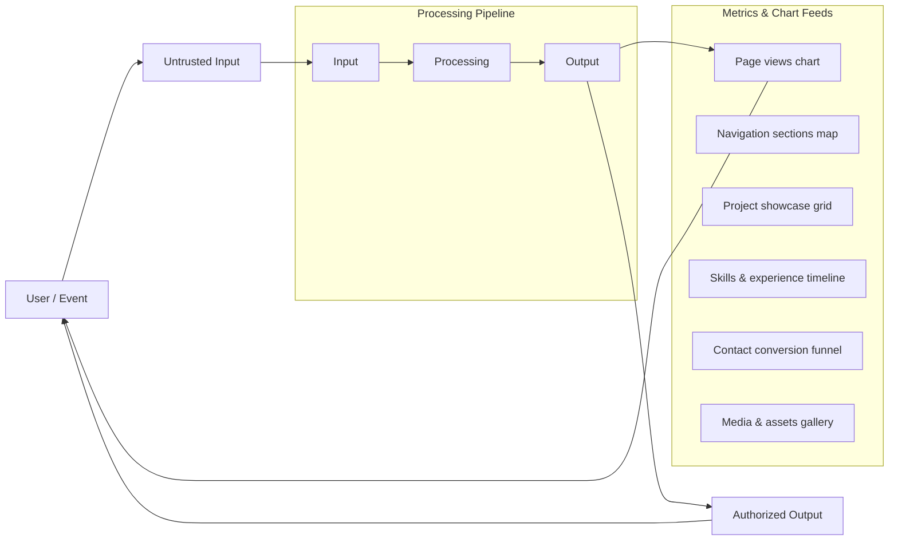
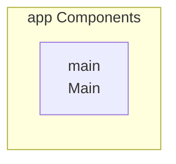
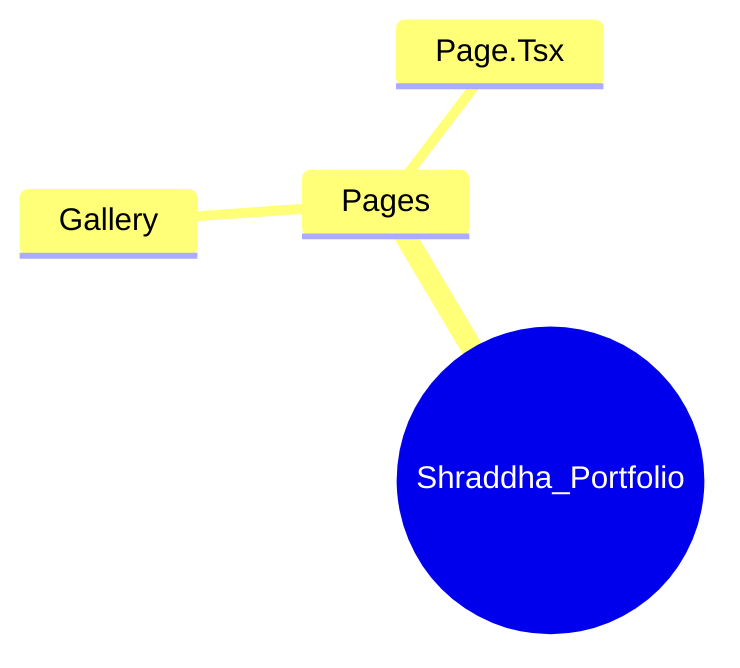
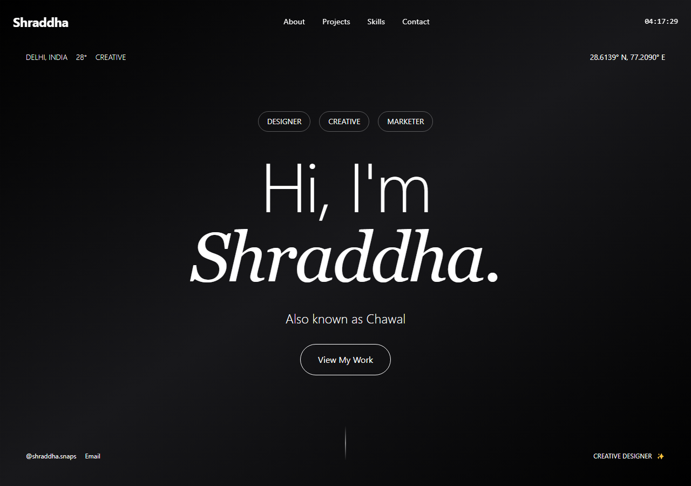
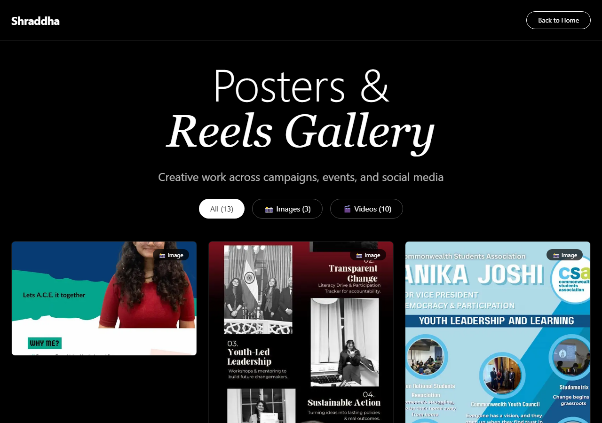

# High-Performance Portfolio Website (Next.js/Three.js)

A complex, highly animated, and interactive portfolio website built using Next.js 14, Three.js, and advanced animation libraries like GSAP and Framer Motion.

## Overview

This project is a sophisticated, single-page portfolio designed to showcase advanced front-end development skills. It heavily relies on smooth scrolling, WebGL rendering (Three.js/R3F), and complex, scroll-triggered animations. The goal is to create a visually stunning, high-performance user experience that guides the visitor through different sections (Hero, About, Skills, Projects, Contact).

## Key Features

- Smooth, scroll-based navigation using Lenis.
- Interactive 3D elements (e.g., particle systems, spheres) rendered via Three.js/R3F.
- Complex text animations and reveals using Framer Motion and GSAP.
- Multi-section layout (Hero, About, Skills, Projects, Contact) within a single page.
- Responsive design using Tailwind CSS.

## Technology Stack

- Next.js 14
- TypeScript
- Tailwind CSS
- Framer Motion
- GSAP (GreenSock Animation Platform)
- Three.js
- React Three Fiber (R3F)
- Lenis

# Shraddha-Inspired Website

A stunning, high-performance website inspired by Shraddha Works featuring smooth animations, 3D graphics, and immersive transitions. Built with modern web technologies to deliver an exceptional user experience.

## ✨ Features

### Animations & Interactions
- 🎨 Beautiful animations with Framer Motion
- ✨ Smooth scrolling with Lenis
- 💫 Animated text reveals with 3D transforms
- 🔢 Animated counters on scroll
- 🎭 Interactive hover effects and micro-interactions
- 🎯 Parallax scrolling effects
- 🖱️ Custom cursor with interactive states
- 🌊 Mouse follower gradient effect
- 📊 Scroll progress indicator

### 3D Graphics
- 🌐 Interactive 3D sphere with distortion effects
- 🎪 Dynamic particle system (500+ particles)
- 🔮 WebGL-powered visuals using Three.js
- 🎬 Auto-rotating camera with orbit controls

### Sections & Components
- 🏠 Hero section with live time/location display
- 📱 Responsive mobile menu
- 🎬 Video modal for showreel
- 🏢 Services showcase with expandable cards
- 🏆 Awards section with animated counters
- 🌟 Infinite scrolling brand logos
- 📈 Stats bar with animated numbers
- 🎯 Approach section with process breakdown
- 💬 Testimonials carousel
- 📧 Contact section with email copy
- ⬆️ Back to top button
- 📄 Comprehensive footer

### Technical
- ⚡ Built with Next.js 14 and TypeScript
- 🎨 Styled with Tailwind CSS
- 📱 Fully responsive design
- 🚀 Optimized performance
- ♿ Accessibility considerations
- 🔍 SEO-friendly structure
- 💾 Loading screen with progress
- 🎯 Custom hooks for reusable logic

## Tech Stack

- **Framework**: Next.js 14
- **Language**: TypeScript
- **Styling**: Tailwind CSS
- **Animations**: Framer Motion, GSAP
- **3D Graphics**: Three.js, React Three Fiber, Drei
- **Smooth Scrolling**: Lenis
- **Icons**: Lucide React

## Getting Started

1. Install dependencies:
```bash
npm install
```

2. Run the development server:
```bash
npm run dev
```

3. Open [http://localhost:3000](http://localhost:3000) in your browser

## Project Structure

```
├── app/
│   ├── globals.css
│   ├── layout.tsx
│   └── page.tsx
├── components/
│   ├── Navigation.tsx
│   ├── Hero.tsx
│   ├── AnimatedText.tsx
│   ├── TextRevealSection.tsx
│   ├── Scene3D.tsx
│   ├── Scene3DSection.tsx
│   ├── AboutSection.tsx
│   ├── ServicesSection.tsx
│   ├── AwardsSection.tsx
│   ├── ContactSection.tsx
│   ├── Footer.tsx
│   └── SmoothScroll.tsx
└── package.json
```

## 🎯 Key Components

### Core Layout
- **Navigation** - Fixed nav with time display, mobile menu integration
- **Hero** - Animated landing with live location/weather/time
- **Footer** - Complete footer with links and contact info
- **LoadingScreen** - Animated loading screen with progress bar

### Interactive Sections
- **Scene3D** - WebGL 3D sphere with particle effects
- **Scene3DSection** - Wrapper for 3D scene with overlay text
- **TextRevealSection** - Scroll-triggered text animations
- **ServicesSection** - Interactive service cards with hover expansions
- **AwardsSection** - Animated counters showcasing achievements
- **BrandsSection** - Infinite scrolling brand logos
- **StatsBar** - Key statistics with animated numbers
- **ApproachSection** - Process breakdown with interactive cards
- **TestimonialsSection** - Client testimonials carousel
- **AboutSection** - Company mission with parallax effects
- **ContactSection** - CTA with email copy functionality

### UI Enhancements
- **CustomCursor** - Interactive cursor with hover states
- **MouseFollower** - Gradient effect following mouse
- **MobileMenu** - Slide-in mobile navigation
- **VideoModal** - Full-screen video player modal
- **ScrollProgress** - Top progress bar showing scroll position
- **BackToTop** - Floating button to return to top
- **ParallaxImage** - Image component with parallax effect

### Utilities
- **SmoothScroll** - Lenis smooth scrolling wrapper
- **AnimatedText** - Reusable text animation component
- **useScrollProgress** - Hook for scroll tracking
- **useMediaQuery** - Hook for responsive breakpoints

## Customization

You can customize the colors, fonts, and content in:
- `tailwind.config.js` - Theme configuration
- `app/globals.css` - Global styles
- Component files - Individual component styling and content

## Build for Production

```bash
npm run build
npm start
```

## License

MIT

# shraddha_portfolio

## Setup Guide

### Frontend Setup

```bash

npm install
npm run dev     # development
npm run build && npm start   # production
```

Open `http://127.0.0.1:3000` (or the port shown in the terminal).

### Running the Application

1. **Start web app** — `npm run dev` in `./`

```bash
cd .
npm install
npm run dev
```

## System Architecture

High-level system design, data flows, API map, and workflow pipelines derived from the repository structure.

### System Architecture



### Data Flow & Charts Pipeline



### Component & API Map



### Application Page Map



## Application Pages

Screenshots captured from the running application. Each page is listed with its function.

#### Design that speaks, creates impact, and drives results.

Application page at `/`



#### Gallery

Application page at `/gallery`


